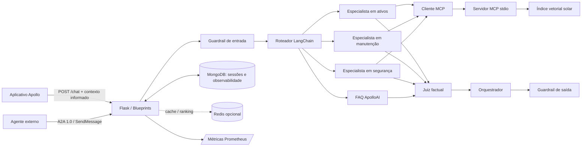

# Arquitetura do ApolloAI

O backend Spring e o PostgreSQL operacional do Apollo estão fora desta fronteira. O ApolloAI recebe apenas contexto já fornecido pelo aplicativo ou pelo técnico. Não identifica, ativa ou altera placas e não registra manutenção.

O padrão Application Factory separa configuração e construção da aplicação. Blueprints separam os contratos HTTP e A2A; Repository encapsula MongoDB; Adapter conecta o grafo ao MCP; StateGraph explicita a orquestração. O estado durável não depende do processo Flask nem do checkpointer em memória.
