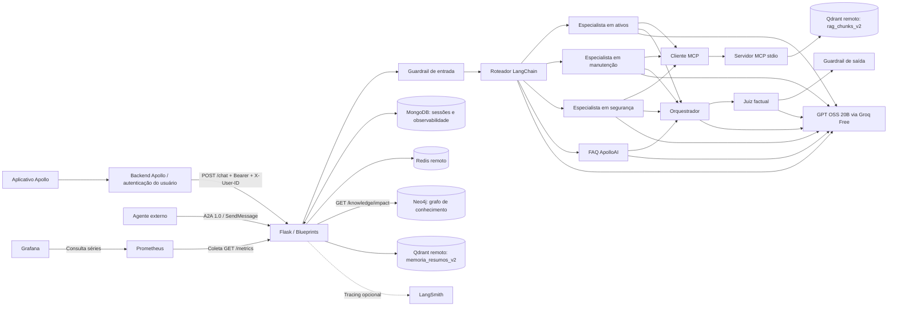

# Arquitetura do ApolloAI

```mermaid
flowchart LR
    Mobile[Aplicativo Apollo] --> Gateway[Backend Apollo / autenticação do usuário]
    Gateway -->|POST /chat + Bearer + X-User-ID| Flask[Flask / Blueprints]
    External[Agente externo] -->|A2A 1.0 / SendMessage| Flask
    Flask --> GE[Guardrail de entrada]
    GE --> R[Roteador LangChain]
    R --> A[Especialista em ativos]
    R --> M[Especialista em manutenção]
    R --> S[Especialista em segurança]
    R --> F[FAQ ApolloAI]
    A & M & S --> MC[Cliente MCP]
    MC --> MS[Servidor MCP stdio]
    MS --> RAG[(Qdrant remoto: rag_chunks_v2)]
    A & M & S & F --> O[Orquestrador]
    O --> J[Juiz factual]
    J --> GS[Guardrail de saída]
    Flask <--> Mongo[(MongoDB: sessões e observabilidade)]
    Flask --> Redis[(Redis remoto)]
    Flask -->|GET /knowledge/impact| Neo4j[(Neo4j: grafo de conhecimento)]
    Flask --> QM[(Qdrant remoto: memoria_resumos_v2)]
    R & A & M & S & F & J & O --> Groq[GPT OSS 20B via Groq Free]
    Prometheus[Prometheus] -->|Coleta GET /metrics| Flask
    Grafana[Grafana] -->|Consulta séries| Prometheus
    Flask -.->|Tracing opcional| LangSmith[LangSmith]
```

O backend Spring e o PostgreSQL operacional do Apollo estão fora desta fronteira. O ApolloAI recebe apenas contexto já fornecido pelo aplicativo ou pelo técnico. Não identifica, ativa ou altera placas e não registra manutenção.

O Neo4j é o extra de BD2: modela conhecimento demonstrativo sobre sistema, componentes, modos de falha e ações de avaliação. A rota de consulta percorre três relações e não participa do fluxo de `/chat`. MongoDB e Redis continuam obrigatórios para a conversa. Veja [o modelo e a pergunta de negócio](NEO4J.md).

Na AWS Academy, Traefik e o Pod ApolloAI executam em um cluster K3s de um nó na EC2. O `LabInstanceProfile` permite que um processo de implantação sincronize o AWS Secrets Manager com um Kubernetes Secret criptografado. O Pod não recebe credenciais AWS permanentes.

O padrão Application Factory separa configuração e construção da aplicação. Blueprints separam os contratos HTTP e A2A; Repository encapsula MongoDB; Adapter conecta o grafo ao MCP; StateGraph explicita a orquestração. O estado durável não depende do processo Flask nem do checkpointer em memória.
