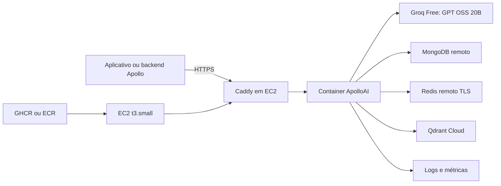

# AWS Academy Learner Lab com orçamento de US$ 50

## Decisão de arquitetura

As instruções do laboratório, atualizadas em 24/06/2025, dizem que somente os
serviços listados podem ser usados. Amazon Bedrock não aparece nessa lista;
portanto, o ApolloAI usa a AWS apenas para hospedar a API e usa Groq no plano
gratuito para o modelo generativo. Não existe troca automática de provedor.

As regiões permitidas pelo laboratório são `us-east-1` e `us-west-2`. Este guia
usa `us-east-1`. O saldo exibido pelo Learner Lab pode atrasar de oito a doze
horas e, se o orçamento for excedido, a conta e os recursos podem ser removidos.



Não use EKS neste laboratório. O plano de controle padrão custa US$ 0,10/h,
aproximadamente US$ 73/mês, antes de EC2, EBS, balanceador e IPv4. Os manifests
Kubernetes do repositório continuam como referência para outro ambiente.

## Estimativa mensal

| Componente | 100 usuários/semana | 1.000 usuários/semana | Premissa |
|---|---:|---:|---|
| EC2 | US$ 7,59 | US$ 15,18 | `t3.micro` ou `t3.small`, 730 h em `us-east-1` |
| IPv4 público | US$ 3,65 | US$ 3,65 | US$ 0,005/h |
| EBS gp3 | US$ 0,64 | US$ 0,64 | 8 GB a US$ 0,08/GB-mês |
| ECR | US$ 0,10 | US$ 0,10 | até 1 GB, sem considerar franquias gratuitas |
| Reserva para logs | US$ 0,52 | US$ 0,53 | estimativa de planejamento |
| **Total estimado** | **US$ 12,50** | **US$ 20,10** | abaixo do orçamento de US$ 50 |

Os valores não incluem impostos, tráfego excedente nem os serviços externos de
MongoDB, Redis e Qdrant. O cenário de 1.000 usuários é uma estimativa de custo,
não uma garantia de capacidade; execute teste de carga antes da apresentação.
Com as premissas atuais de mensagens e agentes, tanto 100 quanto 1.000 usuários
semanais excedem a referência de 200.000 tokens por dia do plano gratuito do
modelo. O relatório `python scripts/estimate_costs.py` evidencia essa restrição
com `free_quota_feasible=false`. O orçamento AWS permanece abaixo de US$ 50,
mas ele não compra capacidade adicional na Groq.

Referências de preço: [EC2 T3](https://docs.aws.amazon.com/prescriptive-guidance/latest/optimize-costs-microsoft-workloads/right-size-selection.html),
[IPv4 público](https://aws.amazon.com/vpc/pricing/),
[EBS gp3](https://aws.amazon.com/ebs/volume-types/),
[ECR](https://aws.amazon.com/ecr/pricing/) e
[EKS](https://aws.amazon.com/eks/pricing/).

## 1. Preparar os serviços externos

Antes de consumir o orçamento AWS, confirme:

- MongoDB remoto com URI `mongodb+srv://`;
- Redis remoto com URI `rediss://`;
- Qdrant Cloud com as collections `rag_chunks` e `memoria_resumos` indexadas;
- conta Groq no plano gratuito, chave criada e modelo
  `openai/gpt-oss-20b` habilitado;
- domínio ou subdomínio já controlado pela equipe.

O Learner Lab permite usar Route 53, mas não registrar um domínio. Registre ou
obtenha o subdomínio fora do laboratório e aponte-o depois para o IPv4 da EC2.
O plano gratuito da Groq retorna erro de limite quando a cota termina; não
adicione forma de pagamento nem migre para um plano pago se a regra do projeto
for custo zero para a API generativa.

Referências: [modelos Groq](https://console.groq.com/docs/models),
[limites](https://console.groq.com/docs/rate-limits) e
[faturamento](https://console.groq.com/docs/billing-faqs).

## 2. Iniciar o laboratório

1. Selecione **Start Lab**.
2. Abra o console AWS pelo link do laboratório.
3. Selecione `us-east-1`.
4. Anote o saldo atual e o horário; o valor não é atualizado em tempo real.
5. Não use **Reset**, pois essa ação remove permanentemente os recursos e não
   restaura o orçamento.

## 3. Criar a EC2

No console EC2, crie uma instância com:

- Amazon Linux 2023 `x86_64`;
- `t3.small` para a primeira homologação completa;
- 8 GB de EBS `gp3`;
- par de chaves `vockey` em `us-east-1`;
- perfil de instância `LabInstanceProfile`;
- IPv4 público ou Elastic IP;
- porta 22 liberada somente para o seu IP;
- portas 80 e 443 liberadas para os clientes;
- porta 5000 fechada para a internet.

Uma Elastic IP mantém o DNS estável entre sessões, mas continua sendo cobrada.
Libere-a ao excluir a implantação.

## 4. Instalar Docker

Conecte-se por SSH ou Session Manager e execute:

```bash
sudo yum update -y
sudo yum install -y docker git
sudo systemctl enable --now docker
sudo usermod -a -G docker ec2-user
```

Saia da sessão e entre novamente para aplicar o grupo `docker`. A instalação
segue o procedimento oficial para
[Docker no Amazon Linux 2023](https://docs.aws.amazon.com/serverless-application-model/latest/developerguide/install-docker.html).

## 5. Preparar domínio e configuração

Aponte um registro DNS `A` para o IPv4 da instância. Depois crie os arquivos:

```bash
sudo mkdir -p /opt/apolloai
sudo chown ec2-user:ec2-user /opt/apolloai
cd /opt/apolloai
```

Copie `deploy/ec2/Caddyfile` para esse diretório e crie `/opt/apolloai/.env`:

```dotenv
APOLLOAI_DOMAIN=api-hml.seudominio.com.br
PUBLIC_BASE_URL=https://api-hml.seudominio.com.br
CORS_ORIGINS=https://app-hml.seudominio.com.br
AUTH_REQUIRED=true
APOLLOAI_API_TOKEN=gere-um-token-forte

AI_PROVIDER=groq
AI_MODEL=openai/gpt-oss-20b
GROQ_API_KEY=preencha-sem-versionar

MONGODB_URI=mongodb+srv://...
MONGODB_DATABASE=apollo_ai_hml
MONGODB_REQUIRED=true
REDIS_URL=rediss://...
REDIS_ENABLED=true
REDIS_REQUIRED=true

QDRANT_URL=https://seu-cluster.aws.cloud.qdrant.io:6333
QDRANT_API_KEY=preencha-sem-versionar
QDRANT_VECTOR_SIZE=768
MCP_REQUIRED=true

AWS_LAB_BUDGET_USD=50
AWS_MONTHLY_COST_100_USERS=12.50
AWS_MONTHLY_COST_1000_USERS=20.10
AI_FREE_DAILY_REQUEST_LIMIT=1000
AI_FREE_DAILY_TOKEN_LIMIT=200000
```

Proteja o arquivo:

```bash
chmod 600 /opt/apolloai/.env
```

Para a entrega final, armazene os valores no AWS Secrets Manager e gere o
arquivo apenas no boot da instância. Nunca coloque esse arquivo no Git, na
imagem ou no aplicativo mobile.

## 6. Executar a imagem imutável

Defina a tag `sha-<commit>` gerada pela CI. Se o pacote GHCR for privado,
execute `docker login ghcr.io` usando um token somente de leitura.

```bash
export APOLLOAI_IMAGE=ghcr.io/apollooficial/chatbot-apolloai:sha-<commit-completo>
docker network create apolloai
docker pull "$APOLLOAI_IMAGE"
docker run -d \
  --name apolloai \
  --restart unless-stopped \
  --network apolloai \
  --env-file /opt/apolloai/.env \
  "$APOLLOAI_IMAGE"
docker run -d \
  --name apolloai-proxy \
  --restart unless-stopped \
  --network apolloai \
  -p 80:80 -p 443:443 \
  --env-file /opt/apolloai/.env \
  -v /opt/apolloai/Caddyfile:/etc/caddy/Caddyfile:ro \
  -v apolloai-caddy-data:/data \
  caddy:2-alpine
```

Caddy solicita e renova o certificado somente depois que o DNS público aponta
para a instância e as portas 80/443 estão acessíveis.

## 7. Validar

```bash
docker ps
docker logs --tail 100 apolloai
docker logs --tail 100 apolloai-proxy
curl --fail https://api-hml.seudominio.com.br/live
curl --fail https://api-hml.seudominio.com.br/health
```

Depois faça uma chamada autenticada a `/chat` e confira `/metrics`. O endpoint
`/health` só responde com sucesso quando MongoDB, Redis, Qdrant e MCP estiverem
prontos.

## 8. Preservar o orçamento

- acompanhe o saldo no Learner Lab e no Cost Explorer;
- use apenas uma instância e evite NAT Gateway, EKS, RDS e load balancer;
- interrompa a EC2 ao terminar o trabalho do dia;
- lembre que o laboratório pode reiniciar instâncias na próxima sessão;
- remova volumes, snapshots e Elastic IP que não serão mais usados;
- exclua aplicações SageMaker e outros recursos de teste;
- mantenha uma margem de pelo menos US$ 10 para atraso de contabilização.

Para desmontar somente os containers:

```bash
docker rm -f apolloai apolloai-proxy
```

Excluir a EC2, o volume EBS e a Elastic IP encerra os principais custos dessa
arquitetura.
