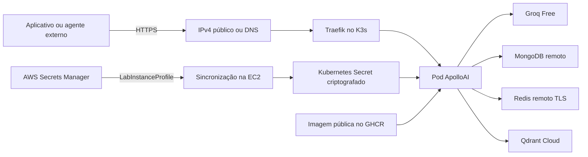

# AWS Academy Learner Lab com K3s

## Decisão de arquitetura

O ApolloAI usa uma única instância EC2 para hospedar um cluster K3s de um nó.
O K3s executa a orquestração Kubernetes na própria instância. O orçamento de
referência do estimador é configurado por `AWS_LAB_BUDGET_USD`.


```mermaid
flowchart LR
    Client[Aplicativo ou agente externo] -->|HTTPS| Public[IPv4 público ou DNS]
    Public --> Traefik[Traefik no K3s]
    Traefik --> API[Pod ApolloAI]
    API --> Groq[Groq Free]
    API --> Mongo[MongoDB remoto]
    API --> Redis[Redis remoto TLS]
    API --> Qdrant[Qdrant Cloud]
    Secrets[AWS Secrets Manager] -->|LabInstanceProfile| Sync[Sincronização na EC2]
    Sync --> KSecret[Kubernetes Secret criptografado]
    KSecret --> API
    GHCR[Imagem pública no GHCR] --> API
```

O K3s utiliza o Traefik incluído na distribuição. O cert-manager solicita e
renova o certificado TLS. Para um IPv4, usa o perfil curto do Let's Encrypt; um
domínio próprio é opcional. O ServiceAccount identifica o Pod apenas dentro do
Kubernetes. O acesso ao Secrets Manager é feito pelo `LabInstanceProfile` da
EC2, sem credenciais AWS permanentes no Pod.

## Premissas de custo mensal

Os valores abaixo são premissas do estimador, não uma cotação atual nem a
fatura da conta AWS. O dimensionamento deve considerar também Prometheus,
Grafana e o modelo local de embeddings.

| Componente | 100 usuários/semana | 1.000 usuários/semana | Premissa |
|---|---:|---:|---|
| EC2 | US$ 7,59 | US$ 15,18 | `t3.micro` ou `t3.small`, 730 h em `us-east-1` |
| IPv4 público | US$ 3,65 | US$ 3,65 | US$ 0,005/h |
| EBS gp3 | US$ 0,64 | US$ 0,64 | 8 GB |
| Secrets Manager | US$ 0,40 | US$ 0,40 | um segredo, sem tráfego relevante |
| Reserva para logs | US$ 0,52 | US$ 0,53 | estimativa de planejamento |
| **Total estimado** | **US$ 12,80** | **US$ 20,40** | abaixo do orçamento de US$ 50 |

O K3s recomenda pelo menos duas CPUs e 2 GB de RAM para um servidor. Uma
`t3.small` está no limite mínimo e deve executar somente uma réplica. Se houver
pressão de memória, redimensione temporariamente para `t3.medium` e acompanhe o
saldo do laboratório. MongoDB, Redis e Qdrant externos não estão incluídos.

Os cenários de uso ultrapassam a referência de 200.000 tokens diários do plano
gratuito configurado. `python scripts/estimate_costs.py` registra essa restrição
com `free_quota_feasible=false`; o orçamento AWS não compra mais cota da Groq.

## 1. Preparar os serviços externos

Confirme antes do deploy:

- MongoDB remoto com URI `mongodb+srv://`;
- Redis remoto com URI `rediss://`;
- Qdrant Cloud com `rag_chunks_v2` e `memoria_resumos_v2` indexadas;
- conta Groq sem forma de pagamento e modelo `openai/gpt-oss-20b` habilitado;
- IPv4 público estável ou domínio controlado pela equipe;
- imagem pública no GHCR com tag `sha-<commit completo>`.

## 2. Criar a EC2 pelo CloudShell

Inicie o Learner Lab, abra o console AWS e selecione `us-east-1`. Abra o
CloudShell pelo ícone de terminal do console. O CloudShell já recebe a
identidade temporária do laboratório; não copie `AWS_ACCESS_KEY_ID`,
`AWS_SECRET_ACCESS_KEY` ou `AWS_SESSION_TOKEN` para a EC2.

No CloudShell, confira a conta e obtenha o repositório:

```bash
aws sts get-caller-identity --query Account --output text
git clone https://github.com/ApolloOficial/Chatbot-ApolloAI.git
cd Chatbot-ApolloAI
bash deploy/aws/provision_ec2.sh
```

Se o repositório já existir no CloudShell, use `cd Chatbot-ApolloAI` e
`git pull --ff-only` antes de executar o script. Ele cria ou reutiliza:

- Amazon Linux 2023 `x86_64` em uma `t3.small`;
- 8 GB de EBS gp3;
- perfil `LabInstanceProfile`;
- chave SSH armazenada em `~/.ssh/apolloai-cloudshell.pem`;
- Security Group com porta 22 apenas para o IPv4 atual do CloudShell e portas
  80 e 443 públicas.

O comando final impresso pelo script tem este formato:

```bash
ssh -i /home/cloudshell-user/.ssh/apolloai-cloudshell.pem ec2-user@NOVO_IPV4
```

Execute exatamente o comando apresentado. Na EC2, aguarde a preparação e
baixe o projeto:

```bash
sudo cloud-init status --wait
docker version
git --version
git clone https://github.com/ApolloOficial/Chatbot-ApolloAI.git
cd Chatbot-ApolloAI
```

O Security Group criado pelo script permite:

- porta 22 somente para o IP da equipe;
- portas 80 e 443 para os clientes;
- nenhuma exposição das portas 5000 e 6443.

Associe um IPv4 estável enquanto o ambiente estiver em uso. Ao excluir a
implantação, libere também a Elastic IP e o volume para interromper a cobrança.

## 3. Configurar o segredo

No AWS Secrets Manager, em `us-east-1`, crie `apolloai/hml` como JSON:

```json
{
  "APOLLOAI_API_TOKEN": "valor forte e exclusivo",
  "GROQ_API_KEY": "chave da conta gratuita",
  "QDRANT_API_KEY": "chave do Qdrant Cloud",
  "MONGODB_URI": "mongodb+srv://...",
  "REDIS_URL": "rediss://..."
}
```

O perfil da instância precisa de `secretsmanager:GetSecretValue` apenas para
esse segredo. Confirme na EC2 sem imprimir o conteúdo:

```bash
aws sts get-caller-identity
aws secretsmanager describe-secret --region us-east-1 --secret-id apolloai/hml
```

## 4. Instalar K3s

Na EC2, entre no repositório atualizado e execute:

```bash
git pull --ff-only
bash deploy/k3s/install.sh
kubectl get nodes
```

O script instala K3s, Traefik e cert-manager `v1.21.2`. Os Kubernetes Secrets
são criptografados no armazenamento do K3s. O kubeconfig fica em
`~/.kube/config` com permissão `600`.

## 5. Configurar endpoint e deploy

Use diretamente o IPv4 público da EC2 em `APOLLOAI_HOST`. Se a equipe possuir
um domínio, também pode criar um registro `A` e informar o hostname. Depois
prepare a configuração sem credenciais:

```bash
cp deploy/k3s/deploy.env.example deploy/k3s/deploy.env
nano deploy/k3s/deploy.env
```

Preencha a tag exata da imagem, IPv4 ou hostname público, origem CORS, URL do
Qdrant, e-mail ACME, identificador do segredo e região. Para servir a interface
no mesmo IPv4, use `CORS_ORIGINS=https://IPV4_PUBLICO`, substituindo o marcador
pelo endereço da instância. O arquivo é ignorado
pelo Git.

Implante:

```bash
bash deploy/k3s/deploy.sh
```

O deploy sincroniza o Secrets Manager com `apolloai-secrets`, renderiza os
manifestos sem placeholders, aplica uma réplica e espera o rollout. O Pod não
recebe chaves AWS.

## 6. Validar e coletar evidências

Depois que o certificado ficar pronto:

```bash
kubectl -n apolloai-hml get pods,service,ingress,certificate
bash deploy/k3s/validate.sh
```

O validador exige HTTP 200 em `/live` e `/health`, chama `/chat` com autenticação,
valida o Agent Card e A2A, executa os testes MCP e RAG contra os serviços remotos
e captura `/metrics`. As evidências ficam em `deploy/k3s/evidence/`, diretório
ignorado pelo Git.

## 7. Operar dentro do orçamento

- pare a EC2 quando o ambiente não estiver sendo demonstrado;
- acompanhe saldo e Cost Explorer;
- não use EKS, NAT Gateway, RDS ou load balancer dedicado;
- mantenha somente uma réplica;
- conserve ao menos US$ 10 para atrasos de contabilização;
- não use **Reset Lab**, pois os recursos podem ser removidos sem restaurar saldo.

Para remover a aplicação sem desinstalar o K3s:

```bash
kubectl delete namespace apolloai-hml
kubectl delete clusterissuer letsencrypt-production
```

Referências: [preço do EKS](https://aws.amazon.com/eks/pricing/),
[requisitos do K3s](https://docs.k3s.io/installation/requirements/),
[instalação do K3s](https://docs.k3s.io/quick-start/) e
[cert-manager](https://cert-manager.io/docs/installation/kubectl/).
