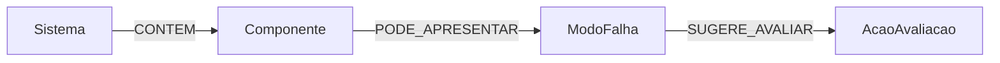

# Neo4j: extra de Banco de Dados 2

O Neo4j guarda um grafo **demonstrativo de conhecimento**, separado do MongoDB conversacional, do ranking Redis e do índice RAG no Qdrant. Não representa o inventário real do aplicativo Apollo e não confirma diagnósticos.

## Modelo

A pequena massa inicial em `app/services/neo4j_service.py` usa a [síntese NREL](../data/solar/documentos/nrel_pv_om_best_practices_sintese.md). Os nomes dos modos de falha representam **hipóteses gerais** e as ações pedem avaliação conforme os procedimentos internos. A carga usa `MERGE`, então pode ser repetida sem duplicar caminhos.

## Demonstração

1. Configure `NEO4J_URI`, `NEO4J_USER` e `NEO4J_PASSWORD` no `.env` para uma instância Neo4j acessível. Instale as dependências de `requirements.txt`.
2. Execute `python -m scripts.seed_neo4j`.
3. Faça `GET /knowledge/impact?componente=Cabo` com o mesmo Bearer e `X-User-ID` usados em `/chat`.

Pergunta de negócio: **“Quais modos de falha podem afetar o cabo do sistema e quais ações de avaliação estão relacionadas?”** A consulta percorre três relações, de `Sistema` até `AcaoAvaliacao`. Ela retorna `sistema`, `componente`, `modo_falha`, `acao_avaliacao` e `fonte`; portanto não é uma busca por um único nó. `Módulo` e `Inversor` também têm caminhos de exemplo. A rota retorna `503` se o Neo4j não estiver configurado ou acessível.

Neo4j é um extra independente: o chatbot continua funcional sem ele. A consulta é somente leitura; a carga é feita pelo comando explícito, não a cada pergunta.
